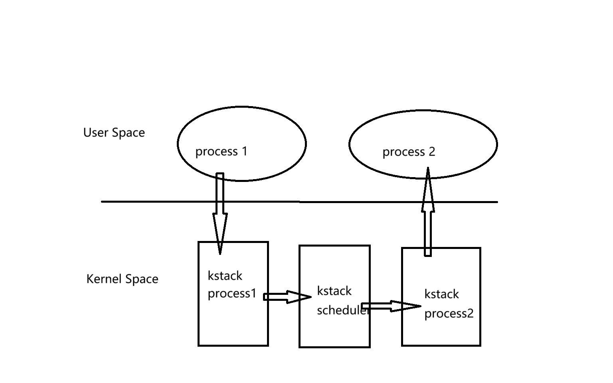

# 实验6

注意：syscall()要在trap_user中调用

## 大致流程

### 内核线程

proczero创建(proc_alloc申请：设置上下文)->proc_scheduler（swtch）

### 进程1

内核态：(proczero的返回地址-下文)forkreturn->trap_user_return(内核态转用户态)

这里设置的上下文设置的不是 在某个时刻中断了，要回到那个时刻 而是要从内核态回到用户态

其中ra设置为forkreturn，sp设置为他准备好的栈

用户态：syscall(SYS_print, "child: hello\n");->触发trap->trap_user_handler(用户态转内核态)

内核态：user_vector->8号异常->执行syscall->trap_user_return(内核态转用户态)

## 测试流程

内核态proc_scheduler->进程1->sys_wait->proc_wait->找到子进程，但是没找到ZOMBIE状态的子进程->进程1 sleep->proc_sched->swtch切换到内核态->内核态proc_scheduler（swtch）->进程2->唤醒进程1->进程1 RUNNABLE->进程2 ZOMBIE

->proc_sched->swtch切换到内核态->内核态proc_scheduler（swtch）->进程1的上下文（进程1在内核态被切换到主进程：从proc_sleep 然后proc_sched swtch走了，再次回来的时候还是proc_sched的swtch）->切换到进程1->等到了子进程ZOMBIE状态

## 理解

有一个内核线程和n个用户进程（由init进程复制而来），用户进程可以进入内核态，但是内核线程一直工作在proc_scheduler中

进程1->fork(进程2：切换到进程2的时候会从fork的下一条指令开始执行)

syscall(SYS_fork);*4会产生2^4个进程

```
    第一个用户态进程的创建
    它的代码和数据位于initcode.h的initcode数组

    第一个进程的用户地址空间布局:
    trapoline   (1 page) 用户和内核页表使用 用户态和内核态切换用到的代码所在的虚拟地址
    trapframe   (1 page) 仅用户页表使用 用户态和内核态切换用到的数据所在的虚拟地址
    ustack      (8 page)
    			(8 page)
        		(8 page)
    			(8 page)
    MMAP_END
    			(8096 page)
    MMAP_BEGIN
                        <--heap_top
    code + data (1 page)
    					<--USER_BASE 用户基地址
    empty space (1 page) 最低的4096字节 不分配物理页，同时不可访问
```

```
	trapoline   (1 page) 用户和内核页表使用 用户态和内核态切换用到的代码所在的虚拟地址
			    (1 page)
    			(1 page)
    KSTACK(0)	(1 page)
    			(1 page)
    KSTACK(1)	(1 page)
    			(1 page)
    KSTACK(2)	(1 page)
```




进程在内核态和用户态之间切换，以及从一个进程切换到另一个进程时，都会涉及到保存和恢复上下文的操作。以下是这些场景中上下文切换的详细解释：

1. **用户态到内核态切换（系统调用）**：
   - 当一个进程执行系统调用时，它会从用户态切换到内核态。在这个过程中，处理器会保存当前的用户态寄存器（包括程序计数器、栈指针等）到进程的内核栈中，然后切换到内核栈，并开始执行内核代码。这一步骤确保了在系统调用结束后，进程可以恢复到正确的执行状态。

2. **内核态到用户态切换（系统调用返回）**：
   - 系统调用完成后，内核需要将控制权返回给用户态的进程。这时，内核会从进程的内核栈中恢复之前保存的用户态寄存器，然后切换回用户态执行。

3. **进程切换（上下文切换）**：
   - 当调度器选择一个新的进程来执行时，会发生上下文切换。这涉及到保存当前进程的CPU寄存器状态（包括通用寄存器、程序计数器、栈指针等）到其进程控制块（PCB）或内核栈中。这些信息构成了进程的上下文，包括用户态和内核态的寄存器。
   - 然后，调度器会加载新进程的上下文到CPU寄存器中，这包括用户态的寄存器和内核态的寄存器（如果新进程之前是在内核态执行的话）。

4. **内核态中的进程切换**：
   - 在内核态中，如果发生中断或异常，处理器会自动保存当前的寄存器状态到当前进程的内核栈中。如果中断处理程序需要切换到另一个进程，那么它会触发上下文切换，保存当前进程的上下文，并恢复新进程的上下文。

上下文切换是操作系统调度和系统调用处理中的关键部分，它确保了进程能够在中断后正确地恢复执行。这个过程对于多任务操作系统来说是至关重要的，因为它允许操作系统在多个进程之间高效地共享处理器资源。