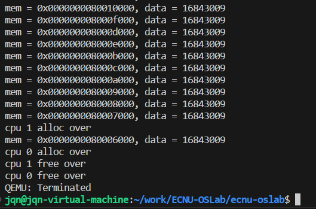
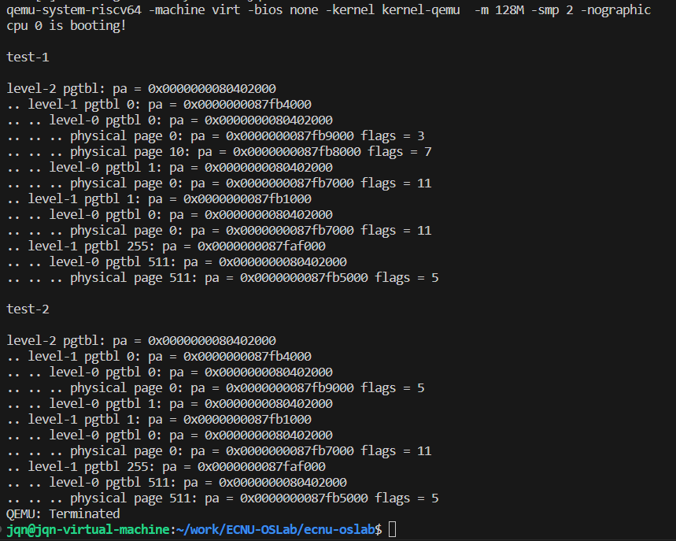

# 实验2

##  第一阶段实验：物理内存的分配与回收

由于需要将内核物理块和用户物理块分开，所以将**未使用可分配的物理页**分成内核使用和用户使用两部分。

### 初始化：pmem_init

初始化**内核可分配的物理页节点**和**用户可分配的物理页节点**，初始化**自旋锁**，并释放一系列对应的物理内存页。

```c
// 物理内存初始化
void pmem_init(void)
{
    // 内核使用
    kern_region.begin = (uint64)ALLOC_BEGIN;
    kern_region.end = kern_region.begin + KERN_PAGES * PGSIZE;
    spinlock_init(&kern_region.lk,"kern_region");
    kern_region.allocable = KERN_PAGES;
    kern_region.list_head.next = NULL;
    freerange(kern_region.begin,kern_region.end,true);

    // 用户使用
    user_region.begin = kern_region.end;
    user_region.end = (uint64)ALLOC_END;
    spinlock_init(&user_region.lk,"user_region");
    user_region.allocable = ( user_region.end - user_region.begin ) / PGSIZE;
    user_region.list_head.next = NULL;
    freerange(user_region.begin,user_region.end,false);
}

//释放一系列物理内存页
void freerange(uint64 start,uint64 end,bool in_kernel)
{
    char* p;
    p=(char*)ALIGN_UP((uint64)start,PGSIZE);
    for(; p+PGSIZE<=(char*)end;p+=PGSIZE)
        pmem_free((uint64)p,in_kernel);
}
```

### 分配：pmem_alloc

```c
// 返回一个可分配的干净物理页
// 失败则panic锁死
void* pmem_alloc(bool in_kernel)
{   
    alloc_region_t *region = in_kernel ? &kern_region : &user_region;
    spinlock_acquire(&region->lk);
    page_node_t *page_node = region->list_head.next;
    if(page_node){
        region->list_head.next = page_node->next;
        region->allocable--;
        spinlock_release(&region->lk);
        memset((void *)page_node, 0, PGSIZE);
    }else{
        panic("pmem_alloc error");
    }
    return (void *)page_node;
}
```

### 回收：pmem_free

```c
// 释放物理页
// 失败则panic锁死
void pmem_free(uint64 page, bool in_kernel)
{
    alloc_region_t *region = in_kernel ? &kern_region : &user_region;
    // 检查传入的页地址是否在分配区域的范围内
    if (page < region->begin || page >= region->end || (page % PGSIZE)!=0) {
        panic("pmem_free: page out of range");
    }
    memset((void*)page, 0, PGSIZE);

    page_node_t *page_node = (page_node_t *)page;
    spinlock_acquire(&region->lk);
    page_node->next = region->list_head.next;
    region->list_head.next = page_node;
    region->allocable++;
    spinlock_release(&region->lk);
}
```

### 实验结果



##  第二阶段: 内核态虚拟内存管理

### 获取页表项：vm_getpte

根据虚拟地址从上级页表中找到对应的页表项：

- 如果页表项有效，根据页表项找到下级页表；
- 如果页表项无效，且在alloc=true的情况下，尝试申请一个物理页，将此物理页作为下级页表，并将无效的页表项替换成刚刚刚刚申请的对应的有效页表项。

最后返回低级页表VPN[0]中对应的pte。

```c
// 根据pagetable,找到va对应的pte
// 若设置alloc=true 则在PTE无效时尝试申请一个物理页
// 成功返回PTE, 失败返回NULL
// 提示：使用 VA_TO_VPN PTE_TO_PA PA_TO_PTE
pte_t* vm_getpte(pgtbl_t pgtbl, uint64 va, bool alloc)
{
    // pgtbl是一个unit64类型的指针，指向一个页面，这个页面里面有很多页表项
    if( va > VA_MAX)
        panic("vm_getpte");
    // Page Table Entry，页表项
    for(int i = 2; i > 0; i--){
        // 指针就是一个地址！
        // pte是地址，*pte是地址所在处的数字
        pte_t *pte = &pgtbl[VA_TO_VPN(va,i)];
        if(*pte & PTE_V){
            pgtbl = (pgtbl_t)PTE_TO_PA(*pte);
        }else{
            // pmem_alloc 返回一个 page_node_t *类型
            // 即返回一个指针，这个指针指向一个 page_node_t（一个指针 64位）
            if(alloc && (pgtbl = (pgtbl_t)pmem_alloc(false)) != 0){
                memset(pgtbl, 0, PGSIZE);
                // 将pte地址所在处填充修改
                *pte = PA_TO_PTE(pgtbl) | PTE_V;
            }else return NULL;
        }
    }
    
    // 从 VPN[0]低级页表 中取地址
    return &pgtbl[VA_TO_VPN(va,0)];
}
```

### 建立映射：vm_mappages

判断参数合法，并将va和pa向下对齐，根据va获取地址，将地址对应的区域填上pa对应的页表项。

```c
// 在pgtbl中建立 [va, va + len) -> [pa, pa + len) 的映射
// 本质是找到va在页表对应位置的pte并修改它
// 检查: va pa 应当是 page-aligned, len(字节数) > 0, va + len <= VA_MAX
// 注意: perm 应该如何使用
void vm_mappages(pgtbl_t pgtbl, uint64 va, uint64 pa, uint64 len, int perm)
{
    uint64 start,end;
    pte_t* pte;
    if((va % PGSIZE) != 0) panic("vm_mappages: va not aligned");
    if((pa % PGSIZE) != 0) panic("vm_mappages: pa not aligned");
    
    start = ALIGN_DOWN(va, PGSIZE);
    end = ALIGN_DOWN(va + len - 1, PGSIZE);
    if(!(len > 0) || !(va + len <= VA_MAX)) panic("vm_mappages: va and len not right");
    for( ; ; start+=PGSIZE, pa+=PGSIZE){
        pte = vm_getpte(pgtbl,start,1);
        if(pte == NULL) panic("vm_mappages: not find pte");
        *pte = PA_TO_PTE(pa) | perm | PTE_V;
        if(start == end) break;
    }
}
```

### 解除映射：vm_unmappages

判断参数合法，并将va和pa向下对齐，根据va获取地址，判断地址对应的区域上的页表项是否合法，将合法的页表项对应的物理页释放，并将页表项清零。

```c
// 解除pgtbl中[va, va+len)区域的映射
// 如果freeit == true则释放对应物理页, 默认是用户的物理页
void vm_unmappages(pgtbl_t pgtbl, uint64 va, uint64 len, bool freeit)
{
    uint64 start,end;
    pte_t* pte;
    if(!(start = ALIGN_DOWN(va, PGSIZE)) || !(end = ALIGN_DOWN(va + len - 1, PGSIZE))){
        panic("vm_mappages: page-aligned error");
    }
    if(!(len > 0) || !(va + len <= VA_MAX)){
        panic("vm_mappages: va and len not right");
    }
    for( ;start < end; start+=PGSIZE){
        pte = vm_getpte(pgtbl,start,1);
        if(pte == NULL) panic("vm_unmappages: not find pte");
        if((*pte & PTE_V) == 0) panic("vm_unmappages: not map");
        if(PTE_FLAGS(*pte) == PTE_V) panic("uvmunmap: not a leaf");
        if(freeit) pmem_free(PTE_TO_PA(*pte), false);
        *pte = 0;
    }
}
```

### 初始化：kvm_init

```c
// 完成 UART CLINT PLIC 内核代码区 内核数据区 可分配区域 的映射
// 相当于填充kernel_pgtbl
void kvm_init()
{
    // 分配kernel_pgtbl，并将其初始化为0
    kernel_pgtbl = (pgtbl_t)pmem_alloc(true);
    memset(kernel_pgtbl, 0, PGSIZE);

    vm_mappages(kernel_pgtbl, UART_BASE, UART_BASE, PGSIZE, PTE_R | PTE_W);
    vm_mappages(kernel_pgtbl, CLINT_BASE, CLINT_BASE, 0x10000, PTE_R | PTE_W);
    vm_mappages(kernel_pgtbl, PLIC_BASE, PLIC_BASE, 0x400000, PTE_R | PTE_W);
    vm_mappages(kernel_pgtbl, KERNEL_BASE, KERNEL_BASE, (uint64)KERNEL_DATA-KERNEL_BASE, PTE_R | PTE_X);
    vm_mappages(kernel_pgtbl, (uint64)KERNEL_DATA, (uint64)KERNEL_DATA, (uint64)ALLOC_BEGIN-(uint64)KERNEL_DATA, PTE_R | PTE_W);
    vm_mappages(kernel_pgtbl, (uint64)ALLOC_BEGIN, (uint64)ALLOC_BEGIN, (uint64)ALLOC_END - (uint64)ALLOC_BEGIN, PTE_R | PTE_W);
}
```

