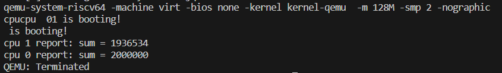
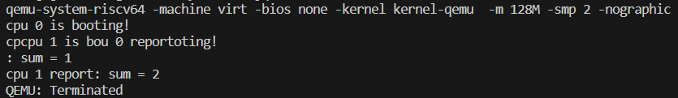

# 实验1

# 双核启动

## 主目录

```makefile
CPUNUM = 2
...
QEMUOPTS += -m 128M -smp $(CPUNUM) -nographic
```

`makefile`文件定义 QEMU 的可执行文件和启动选项，其中：分配 128MB 内存，设置 SMP（对称多处理）核心数为 `CPUNUM=2`，不显示图形界面

```makefile
.PHONY: clean $(KERN)
$(KERN):
	$(MAKE) build --directory=$@
```

定义了一个伪目标 `$(KERN)`，它依赖于 `build` 目标，并在 `kernel` 目录下执行 `make build`。

## /kernel

```makefile
KERNEL_LD  = kernel.ld
...
$(KERNEL_ELF): $(MODULES) $(KERNEL_LD)
	$(LD) $(LDFLAGS) -T $(KERNEL_LD) -o $(KERNEL_ELF) $(OBJS)
```

 `Makefile` 文件用来配置代码编译顺序，`makefile`文件配置从kernel.ld开始执行。

kernel.ld 将_entry作为整个OS的起点放置到0x80000000处，qemu会自动跳转到0x80000000处并开始执行。

1. entry.S：设置栈指针（栈的定义在start.c中），随后跳转到start()，此时在M态。

2. start.c：完成从Machine Mode切换到Supervisor Mode。

   处理一些寄存器的值，进行一些设置，最后调用`mret`跳转到main函数，同时进入到S态。

3. main.c：运行在S态。

# 输出字符串

参考xv6的实现，利用uart层的函数完成 **print.c** 中的函数

同时实现自旋锁，完成**spinlock.c**函数。

# 额外任务

## 1.并行加法计算

```c
#include "riscv.h"
#include "lib/print.h"
#include "lib/lock.h"

// 在计算机体系结构中，缓存一致性是指最终存储在多个本地缓存中的共享数据的一致性。当多个客户端都维护同一个内存资源的缓存时，就可能出现数据不一致的问题。这种情况在多CPU并行系统中尤其常见。
volatile static int started = 0;

volatile static int sum = 0; 

int main()
{
    int cpuid = r_tp();
    if(cpuid == 0) {
        print_init();
        printf("cpu %d is booting!\n", cpuid);      
        __sync_synchronize();
        started = 1;
        for(int i = 0; i < 1000000; i++)
            sum++;
        printf("cpu %d report: sum = %d\n", cpuid, sum);
    } else {
        while(started == 0);
        __sync_synchronize();
        printf("cpu %d is booting!\n", cpuid);
        for(int i = 0; i < 1000000; i++)
            sum++;
        printf("cpu %d report: sum = %d\n", cpuid, sum);
    }   
    while (1);
}  
```


由于有两个cpu参与执行，每个 CPU 都会执行 `main` 函数。

预期结果：两个 CPU 各自对全局变量 `sum` 执行 1,000,000 次增加操作，因此 `sum` 的最终值应该是 2,000,000。

实际结果：由于没有同步机制来保护对 `sum` 的访问，实际上存在竞态条件。两个cpu的写入操作可能同时发生，所以会导致一个 CPU 的写入操作覆盖了另一个 CPU 的写入操作， `sum` 的最终值小于 2,000,000。

将`sum++`修正为`__sync_fetch_and_add(&sum, 1)`，执行原子加法操作，保证操作的原子性，从而可以避免竞态条件和数据不一致的问题。


## 2.并行输出

1.删除`printf`里的锁，发现输出无变化

由于cpu1会等cpu0将`start`设置为`1`才进行第一个输出，此时cpu0的第一个printf已经完成，而此时两个cpu距离第二个输出有一段循环时间存在，所以输出不会错乱。

2.删除start限制

```c
#include "riscv.h"
#include "lib/print.h"
#include "lib/lock.h"

// 在计算机体系结构中，缓存一致性是指最终存储在多个本地缓存中的共享数据的一致性。当多个客户端都维护同一个内存资源的缓存时，就可能出现数据不一致的问题。这种情况在多CPU并行系统中尤其常见。
volatile static int started = 0;

volatile static int sum = 0;

int main()
{
    int cpuid = r_tp();
    if(cpuid == 0) {
        print_init();
        printf("cpu %d is booting!\n", cpuid);      
        __sync_synchronize();
        started = 1;
        for(int i = 0; i < 1000000; i++)
            __sync_fetch_and_add(&sum, 1);
            // sum++;
        printf("cpu %d report: sum = %d\n", cpuid, sum);
    } else {
        // while(started == 0);
        __sync_synchronize();
        printf("cpu %d is booting!\n", cpuid);
        for(int i = 0; i < 1000000; i++)
            __sync_fetch_and_add(&sum, 1);
            // sum++;
        printf("cpu %d report: sum = %d\n", cpuid, sum);
    }   
    while (1);
}  
```



3.删除循环

```c
#include "riscv.h"
#include "lib/print.h"
#include "lib/lock.h"

// 在计算机体系结构中，缓存一致性是指最终存储在多个本地缓存中的共享数据的一致性。当多个客户端都维护同一个内存资源的缓存时，就可能出现数据不一致的问题。这种情况在多CPU并行系统中尤其常见。
volatile static int started = 0;

volatile static int sum = 0; // cpu 1 report: sum = 1013713 cpu 0 report: sum = 1362458
// static int sum = 0; // cpu 1 report: sum = 1000000 cpu 0 report: sum = 1000000
// int sum = 0; // cpu 1 report: sum = 1000000 cpu 0 report: sum = 1000000

// 锁的粒度指的是锁定代码块的大小。
// 锁的粒度越细，锁定的代码越少，系统的并发度越高，但同时需要更频繁地获取和释放锁，这可能会增加锁的争用。
// 锁的粒度越粗，锁定的代码越多，系统的并发度越低，但可以减少锁争用，减少上下文切换和调度开销。

int main()
{
    int cpuid = r_tp();
    if(cpuid == 0) {
        print_init();
        printf("cpu %d is booting!\n", cpuid);      
        __sync_synchronize();
        started = 1;
        // for(int i = 0; i < 1000000; i++)
        //     __sync_fetch_and_add(&sum, 1);
            sum++;
        printf("cpu %d report: sum = %d\n", cpuid, sum);
    } else {
        while(started == 0);
        __sync_synchronize();
        printf("cpu %d is booting!\n", cpuid);
        // for(int i = 0; i < 1000000; i++)
        //     __sync_fetch_and_add(&sum, 1);
            sum++;
        printf("cpu %d report: sum = %d\n", cpuid, sum);
    }   
    while (1);
}  
```

